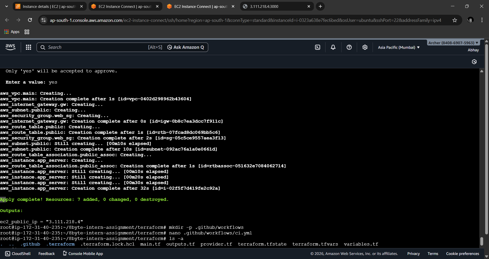
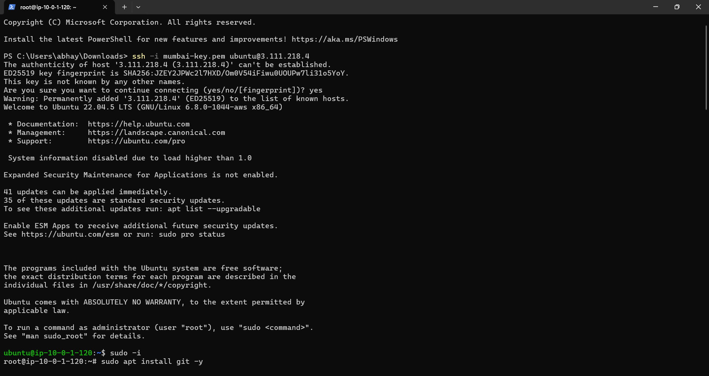
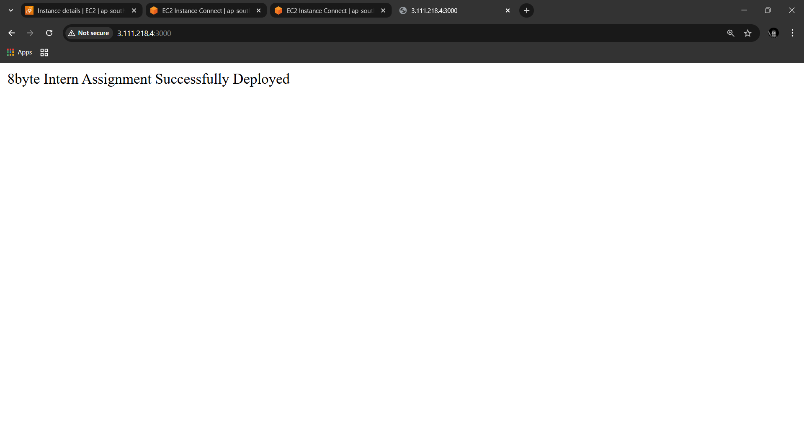
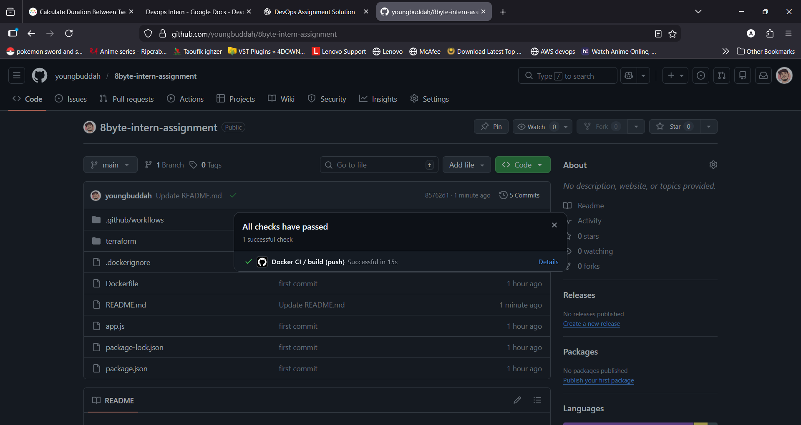

# 🚀 8byte DevOps Intern Assignment

## 📌 Project Overview

This project demonstrates a complete DevOps workflow by containerizing a Node.js application, provisioning AWS infrastructure using Terraform, deploying the application on an EC2 instance, and automating Docker image builds using GitHub Actions CI/CD.

The final application is publicly accessible via an EC2 public IP address.

---

## 🏗 Architecture

```
Developer → GitHub → GitHub Actions → Docker Image
                                      ↓
                                  AWS EC2
                                      ↓
                           Node.js App (Port 3000)
```

---

## ⚙️ Technology Stack

| Component              | Tool              |
| ---------------------- | ----------------- |
| Cloud Provider         | AWS               |
| Infrastructure as Code | Terraform         |
| Containerization       | Docker            |
| CI/CD                  | GitHub Actions    |
| Application            | Node.js (Express) |
| OS                     | Ubuntu 22.04      |

---

## 📁 Project Structure

```
8byte-intern-assignment/
├── app.js
├── package.json
├── Dockerfile
├── .github/workflows/ci.yml
├── terraform/
│   ├── main.tf
│   ├── variables.tf
│   ├── outputs.tf
│   ├── provider.tf
│   └── terraform.tfvars
└── README.md
```

---

## 🚀 Step 1 — Run Application Locally

```bash
npm install
node app.js
```

Open in browser:

```
http://localhost:3000
```

---

## 🐳 Step 2 — Build Docker Image

```bash
docker build -t 8byte-intern-app .
docker run -p 3000:3000 8byte-intern-app
```

Verify:

```
http://localhost:3000
```

---

## ☁️ Step 3 — Provision Infrastructure Using Terraform

```bash
cd terraform
terraform init
terraform plan
terraform apply
```

Terraform provisions:

* VPC
* Public Subnet
* Internet Gateway
* Route Table
* Security Group (Ports 22 and 3000)
* EC2 Ubuntu 22.04 instance with Docker installed

---

## 🚢 Step 4 — Deploy Application on EC2

SSH into the instance:

```bash
ssh -i your-key.pem ubuntu@<EC2_PUBLIC_IP>
```

Clone repository and deploy:

```bash
git clone https://github.com/yourusername/8byte-intern-assignment.git
cd 8byte-intern-assignment
docker build -t 8byte-intern-app .
docker run -d -p 3000:3000 8byte-intern-app
```

Access application:

```
http://<EC2_PUBLIC_IP>:3000
```

---

## 🔄 Step 5 — CI/CD Using GitHub Actions

A GitHub Actions workflow automatically runs on every push to the `main` branch.

Pipeline steps:

1. Checkout code
2. Build Docker image
3. Verify build success
4. (Optional) Push image to Docker Hub

Workflow file:

```
.github/workflows/ci.yml
```

---

## 📸 Screenshots (Attach in Repository)

✔ Terraform apply output

✔ Running EC2 instance

✔ Application running in browser

✔ Successful GitHub Actions pipeline

---

## 🔐 Security Best Practices

* Only required ports opened (22, 3000)
* Dockerized application
* Infrastructure as Code
* No secrets hardcoded
* Terraform state excluded from Git tracking

---

## ✅ Final Output

Public application URL:

```
http://<EC2_PUBLIC_IP>:3000
```

---

## 👨‍💻 Author

**Abhay Bendekar**

---

## 📝 Notes

* Docker installed automatically using Terraform `user_data`
* Node.js app exposed via EC2 public IP
* CI/CD pipeline validates Docker builds on every push

---

